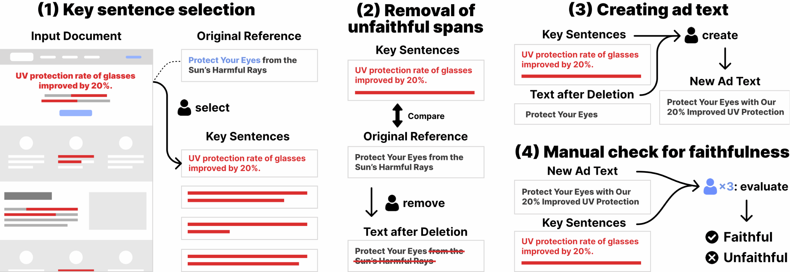

# Overview
Paper: https://arxiv.org/abs/xxxx.xxxxx

In ad text generation (ATG), desirable ad text is both faithful and informative. That is, it should be faithful to the input document, while at the same time containing important information that appeals to potential customers.

The existing evaluation data, [CAMERA (Mita et al.,2024)](https://aclanthology.org/2024.acl-long.54/), is suitable for evaluating informativeness, as it consists of reference ad texts created by ad creators. However, these references often include information unfaithful to the input, which is a notable obstacle in promoting ATG research.

Therefore, we collaborate with in-house ad creators to refine the CAMERA references and develop an alternative ATG evaluation dataset called FaithCAMERA, in which the faithfulness of references is guaranteed.



## Dataset
- The following file is in the Tab-separated values (TSV) format.
    - [FaithCAMERA_ver_001.tsv](./data/FaithCAMERA_ver_001.tsv)

## File Format

As stated above, FaithCAMERA is a revised version of the CAMERA dataset's test set in which a distributed advertisement text ("title_org") is revised as necessary to make it faithful to the input. This dataset is published as a tsv file. Explanation of each field is follows:

- (1) asset_id
    - This field can be used to match each instance in the CAMERA dataset.

- (2) ad_title
    - If an ad text in "title_org" field of the corresponding instance in the CAMERA dataset is faithful to the input, it is adopted as is, and if it is not faithful to the input, the ad text is revised to be faithful to the input using the procedure described in the paper.

- (3) flg_revised
    - When this field is “true”, it means that the ad text has been rewritten to be faithful to the input, and if it is “false”, it means that the CAMERA ad text is already faithful to the input, so no rewriting is done.

### Note
As this dataset is for Japanese ad texts, an instance of asset_id: 100637, for which all sentences in its LP are in English, is excluded (on the tsv file, we set the reference ad text for this instance as an empty string).

## Citation

```bibtex
@misc{kato2024faithcamera,
  title={FaithCAMERA: Construction of a Faithful Dataset for Ad Text Generation},
  author={Akihiko Kato and Masato Mita and Soichiro Murakami and Ukyo Honda and Sho Hoshino and Peinan Zhang
},
      year={2024},
      eprint={xxxx.xxxxx},
      archivePrefix={arXiv},
      primaryClass={cs.CL},
      url={https://arxiv.org/abs/xxxx.xxxxx}, 
}
```

## References
```bibtex
@inproceedings{mita2024striking,
  title={Striking Gold in Advertising: Standardization and Exploration of Ad Text Generation},
  author={Mita, Masato and Murakami, Soichiro and Kato, Akihiko and Zhang, Peinan},
  booktitle={Proceedings of the 62nd Annual Meeting of the Association for Computational Linguistics (Volume 1: Long Papers)},
  pages={955--972},
  year={2024}
}
```

## License
This project is licensed under the [CC BY-NC-SA 4.0](https://creativecommons.org/licenses/by-nc-sa/4.0/) License.
